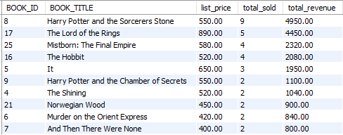

# Bookstore Database System

**Academic database design project analyzing and modeling [Naiin Bookstore](https://www.naiin.com/)'s business operations**

## 📋 Overview

Database system design project analyzing real-world bookstore operations. This is an **academic case study** based on Naiin Bookstore's business model.

- **ER/EER Design** - Multi-entity relationships with proper normalization
- **Business Logic Analysis** - Translated business rules into database constraints
- **Production-Ready Schema** - MySQL implementation with indexes and foreign keys
- **Sample Queries** - Analytics and reporting queries

**Note**: This is an educational project, not an official system for Naiin Bookstore.


## 📊 Database Design

### Entity Relationship Diagram 
**Note**: Please download and open with [draw.io](https://app.diagrams.net/)

- [Chen Notation](docs/eer-chen-notation.drawio)
- [Crow's Foot Notation](docs/eer-crows-foot.drawio)


[More Information: business analysis document (THAI language)](docs/business-analysis.pdf)

## 🚀 Setup

### Prerequisites
- MySQL 8.0+

### Installation
```bash
# Load schema (this file creates DB + USE)
mysql -u root -p < schema/tables.sql

# Load constraints
mysql -u root -p naiin_bookstore < schema/constraints.sql

# Load sample data (optional)
mysql -u root -p naiin_bookstore < schema/sample_data.sql
```

## 📈 Queries

### Sales Analysis
```sql
-- queries/sales_analysis.sql
mysql -u root -p naiin_bookstore < queries/sales_analysis.sql
```

### Example: Best Selling Books (by Revenue)
```sql
SELECT 
    bk.BOOK_ID,
    bk.BOOK_TITLE,
    bk.BOOK_PRICE AS list_price,
    SUM(oi.QUANTITY) AS total_sold,
    SUM(oi.QUANTITY * oi.PRICE) AS total_revenue
FROM BOOK bk
JOIN ORDER_ITEM oi ON bk.BOOK_ID = oi.BOOK_ID
GROUP BY bk.BOOK_ID, bk.BOOK_TITLE, bk.BOOK_PRICE
ORDER BY total_revenue DESC
LIMIT 10;
```



## 📝 Business Rules Implemented

*These are examples from the documents*

1. Each customer can own only one membership card, and each membership card belongs to only one customer.

2. One seller can issue membership cards for many customers, but each customer’s card is issued by only one seller.

3. One branch can issue membership cards for many customers/cards, but each membership card is issued by only one branch.

4. One membership card can use multiple promotions, and each promotion can be used by multiple membership cards.

5. Each order is processed using one membership card, and one membership card can be used in multiple orders.

6. One membership card can be renewed multiple times, and each renewal record belongs to one membership card.

## 🛠️ Tech Stack

- **Database**: MySQL 8.0
- **Design Tools**: Draw.io for ER diagrams
- **Documentation**: Academic analysis + technical implementation

## 📚 Documentation

Complete business analysis and requirements documentation available in [docs/business-analysis.pdf](docs/business-analysis.pdf)

## 🎓 Project Context

**Academic Case Study** - Database Design, Mahidol University (2024)

This project analyzes Naiin Bookstore as a case study to practice:
- Business process analysis
- Database requirements gathering
- ER/EER diagram design
- SQL schema implementation

The business analysis (team project) and SQL implementation (individual work) are based on publicly available information about Naiin Bookstore's operations.

---

**Note**: This is a database design project. No frontend/backend application included.